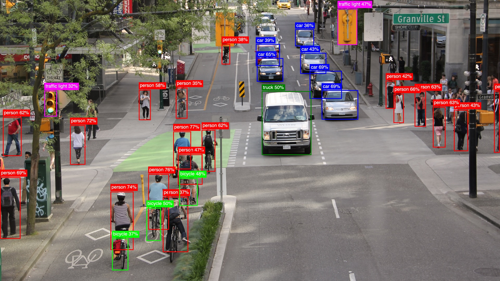
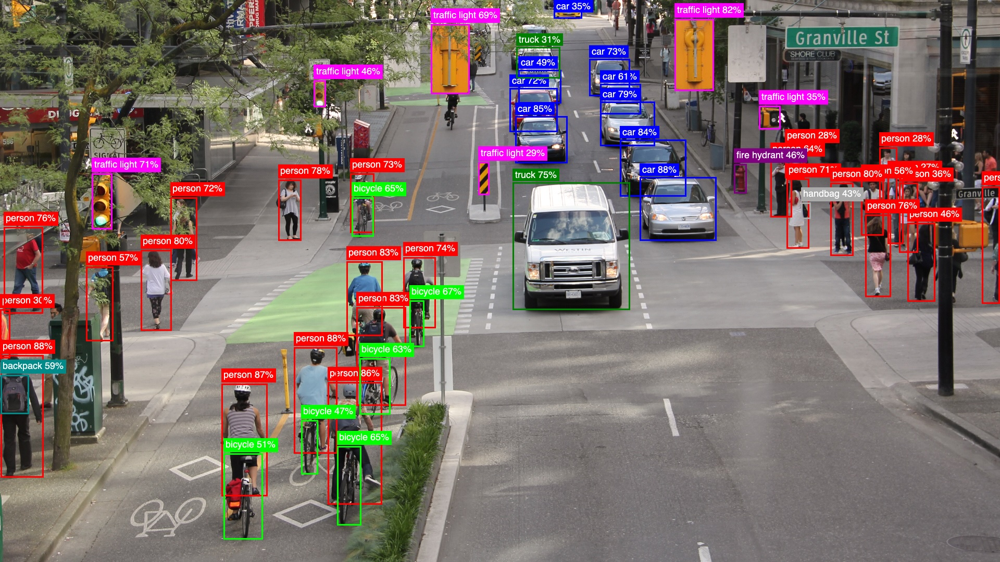

You Only Look Once (YOLO) is a cutting-edge, real-time object detection system. It works by predicting bounding boxes and class probabilities directly from an input image in a single evaluation, making it exceptionally fast compared to other object detection methods. YOLO models are widely used in applications like autonomous driving, surveillance, and robotics due to their balance of speed and accuracy.  




`YOLO` is an Elixir library designed to simplify object detection by providing seamless integration of YOLO models. With this library, you can efficiently utilize the power of YOLO for real-time object detection.  

The library is built with the following objectives:  

1. **Speed**  
   Achieve real-time object detection performance, even on resource-constrained devices like a MacBook Air M3. Details about performance can be found in the [benchmarks section](#benchmarks).  

2. **Ease of Use**  
   Designed to be straightforward and user-friendly, the library enables developers to load and detect objects with just two function calls.

3. **Extensibility**  
   Currently supporting YOLOv8 (in various model sizes such as `n`, `s`, ..., `x`), the library is built around a `YOLO.Model` behavior. It leverages ONNX and Ortex, making it adaptable for supporting other YOLO versions or custom models in the future.  


## IMPORTANT: ONNX model files!
To run a YOLOv8 model, we typically need the neural network structure and the pre-trained weights obtained from training the model. While we could build the network using libraries like Axon (or Keras in Python), I've prefered to simplify the process by using a pre-existing PyTorch model from [Ultralytics](https://docs.ultralytics.com/models/yolov8/). Ultralytics developed and trained [YOLOv8 models](https://github.com/ultralytics/assets/releases/tag/v8.3.0), which are available under a GPL license. However, to avoid potential licensing conflicts with this library, I haven't included the ONNX model exports directly here. Instead, you need to convert the PyTorch .pt file into an ONNX format. No worries, I got you covered!

Ultralytics' YOLOv8 comes in several sizes: n (nano), s (small), m (medium), l (large), and x (extra-large). Larger models offer better performance in terms of classification accuracy and object detection but require more computational resources and memory.


You can use the `python/yolov8_to_onnx.py` script found in the [GitHub repo](https://github.com/poeticoding/yolo_elixir).

First, install the dependencies (`requests` and `ultralytics`)
```bash
pip install -r python/requirements.txt
```

Then, run the script by specifying the model size, such as `n`:

```bash
python python/yolov8_to_onnx.py n
```


The script will download the `.pt` model and generate two files:

* `models/yolov8n.onnx`: the YOLOv8n model with weights
* `models/yolov8n_classes.json`: the list of object classes


## Getting Started

First install the library and configure Nx.
```elixir
Mix.install([
  {:yolo, "~> 0.1.0"},

  # I'm using EXLA as Nx backend on my MacBook Air M3
  {:exla, "~> 0.9.2"},
  # evision for image processing (you can use :image instead)
  {:evision, "~> 0.2.0"}
]
], config: [
  nx: [default_backend: EXLA.Backend]
])
```

Then you need just a few lines of code to get a list of objects detected in the image.

```elixir  
model = YOLO.load([
  model_path: "models/yolov8n.onnx", 
  classes_path: "models/yolov8n_classes.json"
])

mat = Evision.imread(image_path)

model
|> YOLO.detect(mat)
|> YOLO.to_detected_objects(model.classes)

```
This code returns a list of detected objects along with their bounding box coordinates.

```elixir
[
  %{
    class: "person",
    prob: 0.5744523406028748,
    bbox: %{h: 126, w: 70, cx: 700, cy: 570},
    class_idx: 0
  },
  %{
    class: "bicycle",
    prob: 0.6159384846687317,
    bbox: %{h: 102, w: 71, cx: 726, cy: 738},
    class_idx: 1
  },
  %{class: "car", prob: 0.6243442893028259, bbox: %{h: 87, w: 102, cx: 1039, cy: 268}, class_idx: 2},
  ...
]
```


## YoloV8x
To run a larger YoloV8 model is simple.

Use the python script to generate the `yolov8x.onnx` model and the `yolov8x_classes.json` file.

```
python python/yolov8_to_onnx.py x
```

Then you can load the model and use it just like before.

```elixir
model_x = YOLO.load(model_path: "code/yolo/models/yolov8x.onnx", classes_path: classes_path)

model_x
|> YOLO.detect(mat)
|> YOLO.to_detected_objects(model_x.classes)    

```



## Make it faster with FastNMS

Non-Maximum Suppression (NMS) is what makes the postprocessing slow in the Elixir implementation. The native Nx implementation is not fast enough to achieve good real-time performance. With the `YoloFastNMS` library providing a Rust NIF implementation, it's possible to run the postprocessing much faster - simply include the dependency and pass the module to `detect/3`. This can **speed up postprocessing by around 100x** (from ~400ms to ~4ms on a MacBook Air M3).

```elixir
def deps do
  [
    {:yolo_fast_nms, "~> 0.1"}
  ]
end
```

Then you can run the detection with FastNMS by passing the `YoloFastNMS` module to `detect/3`.
```elixir
YOLO.detect(model, mat, nms_fun: &YoloFastNMS.run/3)
```

## Benchmarks
Benchmarks below are run on a MacBook Air M3 with EXLA as Nx backend.

```text
Operating System: macOS
CPU Information: Apple M3
Number of Available Cores: 8
Available memory: 16 GB
Elixir 1.17.2
Erlang 27.1.2
JIT enabled: true
```
### `detect/3` with `YoloFastNMS` vs Ultralytics 
[benchmarks/yolov8n.exs](benchmarks/yolov8n.exs)
```text
Name                            ips        average  deviation         median         99th %
detect/3 with FastNMS         26.09       38.32 ms     ±4.43%       38.09 ms       48.83 ms

Memory usage statistics:

Name                          average  deviation         median         99th %
detect/3 with FastNMS        48.42 KB     ±5.92%       47.25 KB       56.06 KB
```

[benchmarks/yolov8n_cpu.py](benchmarks/yolov8n_cpu.py)

```text
0: 384x640 17 persons, 3 bicycles, 6 cars, 1 truck, 2 traffic lights, 39.0ms
Speed: 1.2ms preprocess, 39.0ms inference, 0.3ms postprocess per image at shape (1, 3, 384, 640)
```


### `YOLO.NMS` vs `YoloFastNMS`
[benchmarks/nms.exs](benchmarks/nms.exs)
```text
Name                  ips        average  deviation         median         99th %
YoloFastNMS        528.63        1.89 ms     ±0.56%        1.89 ms        1.93 ms
YOLO.NMS             2.28      437.78 ms     ±0.43%      438.21 ms      441.01 ms

Comparison:
YoloFastNMS        528.63
YOLO.NMS             2.28 - 231.42x slower +435.89 ms

Memory usage statistics:

Name           Memory usage
YoloFastNMS      0.00651 MB
YOLO.NMS          810.22 MB - 124497.68x memory usage +810.21 MB
```

### `preprocess/3`, `run/2`, `postprocess/4`
[benchmarks/yolov8n_pipeline.exs](benchmarks/yolov8n_pipeline.exs)
```text
Name                          ips        average  deviation         median         99th %
preprocess                 467.31        2.14 ms    ±11.15%        2.12 ms        2.76 ms
postprocess FastNMS        421.43        2.37 ms     ±6.04%        2.36 ms        2.68 ms
run                         27.04       36.98 ms     ±3.01%       36.74 ms       40.18 ms

Comparison:
preprocess                 467.31
postprocess FastNMS        421.43 - 1.11x slower +0.23 ms
run                         27.04 - 17.28x slower +34.84 ms

Memory usage statistics:

Name                        average  deviation         median         99th %
preprocess                 43.78 KB     ±0.00%       43.78 KB       43.78 KB
postprocess FastNMS         2.02 KB    ±92.71%        1.18 KB        6.62 KB
run                         1.18 KB     ±0.00%        1.18 KB        1.18 KB

Comparison:
preprocess                 43.78 KB
postprocess FastNMS         2.02 KB - 0.05x memory usage -41.76387 KB
run                         1.18 KB - 0.03x memory usage -42.60156 KB
```


## Livebook Examples

* [YoloV8 Single Image](examples/yolov8_single_image.livemd): A beginner-friendly example that demonstrates object detection on a single image, comparing results between the lightweight YOLOv8n model and the more accurate YOLOv8x model.
* [Make it faster with YoloFastNMS](examples/yolo_fast_nms.livemd): A livebook that shows how to use the `YoloFastNMS` library to speed up the object detection postprocessing.
* [Real-time Object Detection](examples/yolov8_webcam.livemd): A livebook that demonstrates real-time object detection using your computer's webcam, with live frame updates and visualization of detected objects.


## Under the Hood
Let's see how `YOLO.detect/3` works.

### Load YoloV8n Model
Loads the *YoloV8n* model using the `model_path` and `classes_path`. Optionally, specify `model_impl`, which defaults to `YOLO.Models.YoloV8`.

```elixir
model = YOLO.load([
  model_path: "models/yolov8n.onnx", 
  classes_path: "models/yolov8n_classes.json"
])
```

### Preprocessing

```elixir
mat = Evision.imread(image_path)

{input_tensor, scaling_config} = YOLO.Models.YoloV8.preprocess(model, mat, [frame_scaler: YOLO.FrameScalers.EvisionScaler])
```

Before running object detection, the input image needs to be preprocessed to match the model's expected input format. The preprocessing steps are:

1. **Resize and Pad Image to 640x640**
   - The image is resized while preserving aspect ratio to fit within 640x640 pixels
   - Any remaining space is padded with gray color (value 114) to reach exactly 640x640
   - This is handled by the `FrameScaler` behaviour and its implementations

2. **Convert to Normalized Tensor**
   - The image is converted to an Nx tensor with shape `{1, 3, 640, 640}`
   - Pixel values are normalized from `0-255` to `0.0-1.0` range
   - The channels are reordered from `RGB` to the model's expected format (`BGR` in this case)

The `FrameScaler` behaviour provides a consistent interface for handling different image formats:

- `EvisionScaler` - For OpenCV Mat images from Evision
- `ImageScaler` - For images using the Image library  
- `NxIdentityScaler` - For ready to use Nx tensors


### Run Object Detection
Then run the detection by passing the `model` and the image tensor `input_tensor`.

```elixir
# input_tensor {1, 3, 640, 640}
output_tensor = YOLO.Models.run(model, input_tensor)
# output_tensor {1, 84, 8400}
```

You can also adjust detection thresholds (`iou_threshold` and `prob_threshold`, which both default to `0.45` and `0.25` respectively) using the third argument.


### Postprocessing
```elixir
result_rows = YOLO.Models.YoloV8.postprocess(model, output_tensor, scaling_config, opts)
```
where `result_rows` is a list of lists, where each inner list represents a detected object with 6 elements:

```elixir
[
  [cx, cy, w, h, prob, class_idx],
  ...
]
```

The model's raw output needs to be post-processed to extract meaningful detections. For YOLOv8n, the `output_tensor` has shape `{1, 84, 8400}` where:

- 84 represents 4 bbox coordinates + 80 class probabilities
- 8400 represents the number of candidate detections

The postprocessing steps are:

1. **Filter Low Probability Detections**
   - Each of the 8400 detections has probabilities for 80 classes
   - Only keep detections where max class probability exceeds `prob_threshold` (default 0.25)

2. **Non-Maximum Suppression (NMS)**
   - Remove overlapping boxes for the same object
   - For each class, compare boxes using Intersection over Union (IoU)
   - If IoU > `iou_threshold` (default 0.45), keep only highest probability box
   - This prevents multiple detections of the same object

3. **Scale Coordinates**
   - The detected coordinates are based on the model's 640x640 input
   - Use the `scaling_config` from preprocessing to map back to original image size
   - This accounts for any resizing/padding done during preprocessing


### Convert Detections to Structured Maps
Finally, convert the raw detection results into structured maps containing bounding box coordinates, class labels, and probabilities:
```elixir
iex> YOLO.to_detected_objects(result_rows, model.classes)
[
  %{
    class: "person",
    prob: 0.57,
    bbox: %{h: 126, w: 70, cx: 700, cy: 570},
    class_idx: 0
  },
  ...
]
```


## Current Limitations

The current implementation supports YOLOv8 models with a fixed `640x640` input size (even though YOLOv8x6 supports `1280x1280` images) and a fixed `84x8400` output size. This setup handles 80 classes from the COCO dataset and 8400 detections.

The library is designed to be extensible through the `YOLO.Model` behaviour, allowing other YOLO versions or custom model implementations to be added in the future. 

## Future Plans  
One of the next goals (listed in the TODO section below) is to support models with different input and output sizes. This update would allow the library to work with YOLO models trained on other datasets or even custom datasets, making it more flexible and useful.
## TODOs
### Improvements
* [ ] Support dynamically different input and output shapes. (This is going to be foundamental to support different models with custom classes).
* [ ] Kino library to easily visualize detections

### Experiments
* [ ] CUDA benchmarks
* [ ] Object tracking
* [ ] Run it on Nerves Rpi5
* [ ] Run it on Jetson
* [ ] Sharding
