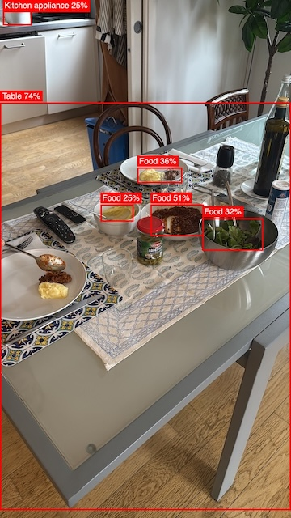

[Getting Started](#getting-started) | [LiveBook Examples](#livebook-examples) | [Benchmarks](guides/benchmarks.md) | [Under the Hood](guides/under_the_hood.md)

You Only Look Once (YOLO) is a cutting-edge, real-time object detection system. It works by predicting bounding boxes and class probabilities directly from an input image in a single evaluation, making it exceptionally fast compared to other object detection methods. YOLO models are widely used in applications like autonomous driving, surveillance, and robotics due to their balance of speed and accuracy.  


`YOLO` is an Elixir library designed to simplify object detection by providing seamless integration of YOLO models. With this library, you can efficiently utilize the power of YOLO for real-time object detection.  

The library is built with the following objectives:  

1. **Speed**  
   Achieve real-time object detection performance, even on resource-constrained devices like a MacBook Air M3. Details about performance can be found in the [benchmarks section](#benchmarks).  

2. **Ease of Use**  
   Designed to be straightforward and user-friendly, the library enables developers to load and detect objects with just two function calls.

3. **Extensibility**  
   Supporting Ultralytics YOLO and YOLOX models (in various sizes), the library is built around a `YOLO.Model` behavior. It leverages ONNX and Ortex and the library is not limited to specific model architectures - it can handle any number of detection candidates and classes, making it perfect for custom-trained models.


## Supported Models

The library requires YOLO models in ONNX format, which combines both the neural network architecture and pre-trained weights. Currently, we support two model families:

* **YOLOX**: Pre-converted ONNX models are available directly from the [YOLOX repository](https://github.com/Megvii-BaseDetection/YOLOX/tree/main/demo/ONNXRuntime)
* [**Ultralytics**](guides/ultralytics_to_onnx.md): These models need to be converted from PyTorch (.pt) to ONNX format (https://github.com/ultralytics/assets/releases/tag/v8.3.0) [follow this simple guide to prepare the model in ONNX format](guides/ultralytics_to_onnx.md)


All these models come in different sizes, like *n (nano)*, *s (small)*, *m (medium)*, *l (large)*, and *x (extra-large)*. Larger models offer better performance in terms of classification accuracy and object detection but require more computational resources and memory.


## Getting Started

### Installation and Configuration

```elixir
# mix.exs

defp deps do
  {:yolo, ">= 0.2.0"},

  # I'm using EXLA as Nx backend
  # Nx is mostly used for pre/post processing
  {:exla, "~> 0.9.2"},
  # evision for image processing (you can use :image instead)
  {:evision, "~> 0.2.0"}
end
```

To enable hardware acceleration in Ortex based on platform (CoreML on Mac, DirectML on Windows, CUDA/TensorRT on Linux)
```elixir
# Mac with CoreML
config :ortex, Ortex.Native, features: [:coreml]

# Windows machine, DirectML
config :ortex, Ortex.Native, features: [:directml]

#CUDA/TensorRT
config :ortex, Ortex.Native, features: [:cuda, :tensorrt]
```

In case you run YOLO on [LiveBook](https://livebook.dev/) or iex

```elixir
Mix.install([
  :exla,
  # evision for image processing (you can use :image instead)
  :evision,

  {:yolo, ">= 0.2.0"}
])
```
And in case you want, for example, CUDA acceleration

```elixir
Mix.install([
  :exla,
  # evision for image processing (you can use :image instead)
  :evision,

  {:yolo, ">= 0.2.0"}
],
[
  config: [
    # an example where we use CUDA acceleration for both Ortex and EXLA
    ortex: {Ortex.Native, features: [:cuda]},
    nx: [default_backend: {EXLA.Backend, client: :cuda}]
  ]
])
```

### Load and Run

Here we are using YOLOX, for this example, but you can use ultralytics just by loading the ultralytics model onnx and setting `model_impl` to `YOLO.Models.Ultralytics` (which is the default `model_impl` implementation).

Pre-converted YOLOX ONNX models are available directly on the [YOLOX repository](https://github.com/Megvii-BaseDetection/YOLOX/tree/main/demo/ONNXRuntime).

Loading YOLOX nano, in this case with `:cpu` Execution provider.

```elixir
model = YOLO.load(
  model_impl: YOLO.Models.YOLOX,
  model_path: "models/yolox_nano.onnx", 
  classes_path: "models/coco_classes.json", 

  # Ortex execution providers (same as the `:ortex` config)
  # Mac with CoreML
  eps: [:cpu] # or [:coreml], [:directml] or [:cuda, :tensorrt], default: [:cpu]
)
```

If instead you want to load an Ultralytics YOLO model 
```elixir
model = YOLO.load(
  model_impl: YOLO.Models.Ultralytics,
  model_path: "models/yolo11n.onnx",
  ...
)
```

Loading the traffic image and running YOLO.
```elixir
mat = Evision.imread("guides/images/traffic.jpg")

model
|> YOLO.detect(mat)
|> YOLO.to_detected_objects(model.classes)    

```

This code returns a list of detected objects along with their bounding box coordinates.

```elixir
[
  %{
    class: "person",
    prob: 0.57
    bbox: %{h: 126, w: 70, cx: 700, cy: 570},
    class_idx: 0
  },
  %{
    class: "bicycle",
    prob: 0.61
    bbox: %{h: 102, w: 71, cx: 726, cy: 738},
    class_idx: 1
  },
  %{class: "car", prob: 0.62, bbox: %{h: 87, w: 102, cx: 1039, cy: 268}, class_idx: 2},
  ...
]
```

### Visualize detection results
For visualizing detection results on images, you can use the [KinoYOLO](https://github.com/poeticoding/kino_yolo) utility library. While the name suggests Kino integration, it only depends on the `image` package. The library is currently available on GitHub's main branch (not yet published to Hex).

```elixir
# using Image instead of Evision
image = Image.open("guides/images/traffic.jpg")

detected_objects = 
  model
  # here we are passing the image and we need the YOLO.FrameScalers.ImageScaler
  # instead of the default `YOLO.FrameScalers.EvisionScaler`
  |> YOLO.detect(image, frame_scaler: YOLO.FrameScalers.ImageScaler)
  |> YOLO.to_detected_objects(model.classes)    

KinoYOLO.Draw.draw_detected_objects(image, detected_objects)
```


Alternatively, you can process the image with `Evision` through the YOLO pipeline, convert the resulting `mat` to an `Image` type, and visualize the detections using `KinoYOLO.Draw.draw_detected_objects/2`.


## Post-processing - Make it faster with FastNMS

The default `YOLO.NMS` implementation (from version 0.2) uses `Nx.Defn` for postprocessing and is already quite fast for real-time YOLO detection. However, if you need to squeeze every millisecond of performance, you can use the [`YoloFastNMS`](https://github.com/poeticoding/yolo_fast_nms) library which provides a Rust NIF implementation that should be 2x faster.

```elixir
def deps do
  [
    {:yolo_fast_nms, "~> 0.2"}
  ]
end
```

Then you can run the detection with FastNMS by passing the `YoloFastNMS.run/2` function to `detect/3`.
```elixir
YOLO.detect(model, mat, nms_fun: &YoloFastNMS.run/2)
```

## Models trained on different datasets
While most publicly available object detection models are trained on the COCO dataset (which includes 80 object classes), this library supports models trained on any dataset. For instance, you can use the Ultralytics Open Images V7 model that can detect over 600 different object classes. The library automatically adapts to different models - simply specify the appropriate ONNX model and classes path, along with the correct model implementation (e.g., `YOLO.Models.Ultralytics` for Ultralytics models).

For a complete example, see the [Ultralytics YOLOv8 - Open Images V7](examples/yolo_oiv7.livemd) livebook.



## Livebook Examples

* [Ultralytics YOLO](examples/ultralytics_yolo.livemd): Demonstrates the complete workflow of using Ultralytics YOLOv11, from downloading and converting the model to ONNX format using Python, to running object detection on a traffic scene image containing multiple objects like cars, bicycles, and pedestrians.
* [YOLOX](examples/yolox.livemd): Shows how to use YOLOX, an alternative YOLO implementation that offers similar performance but with a more permissive Apache License 2.0 (compared to Ultralytics' AGPL license). Includes downloading pre-converted ONNX models and running inference directly.
* [Ultralytics YOLOv8 - Open Images V7](examples/yolo_oiv7.livemd): While the previous examples use models trained on COCO's 80 classes, this example demonstrates how to use a model trained on a different dataset. It shows how to run Ultralytics YOLOv8x, an extra-large model trained on the Open Images V7 dataset that can detect over 600 different object classes.
* [Real-time Object Detection](examples/webcam.livemd): A livebook example showing how to perform real-time object detection using your webcam, with continuous frame processing and real-time visualization of detected objects.

## [Performance Benchmarks](guides/benchmarks.md) - See how YOLO performs on different models and devices


## Under the Hood

See [Under the Hood](guides/under_the_hood.md) for a detailed explanation of how YOLO works internally, including preprocessing, model inference, and postprocessing steps.

